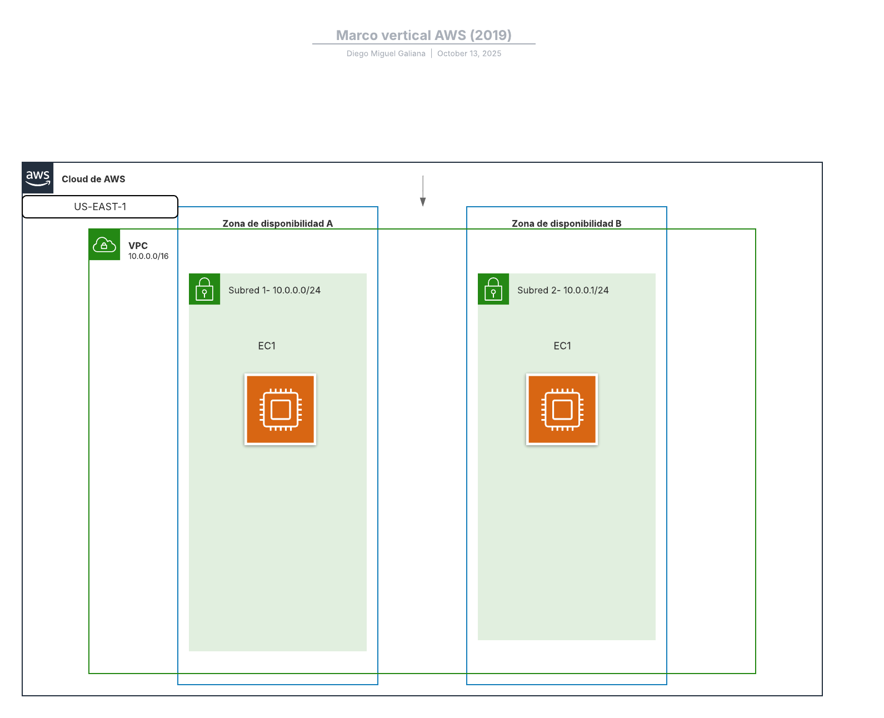

# Exercici Terraform 1

## Objectiu
Crear dues instàncies EC2 tipus `t3.micro` amb **Amazon Linux 2023** a la regió `us-east-1`.

---

## Configuració Terraform
El fitxer `main.tf` defineix:
- El proveïdor AWS amb la regió `us-east-1`
- Dues instàncies EC2 (`t3.micro`)
- Sistema operatiu: Amazon Linux 2023

### Execució

```bash
terraform init
terraform plan
terraform apply
```


Aquí tenemos la Topologia del Ejercicio 1.
